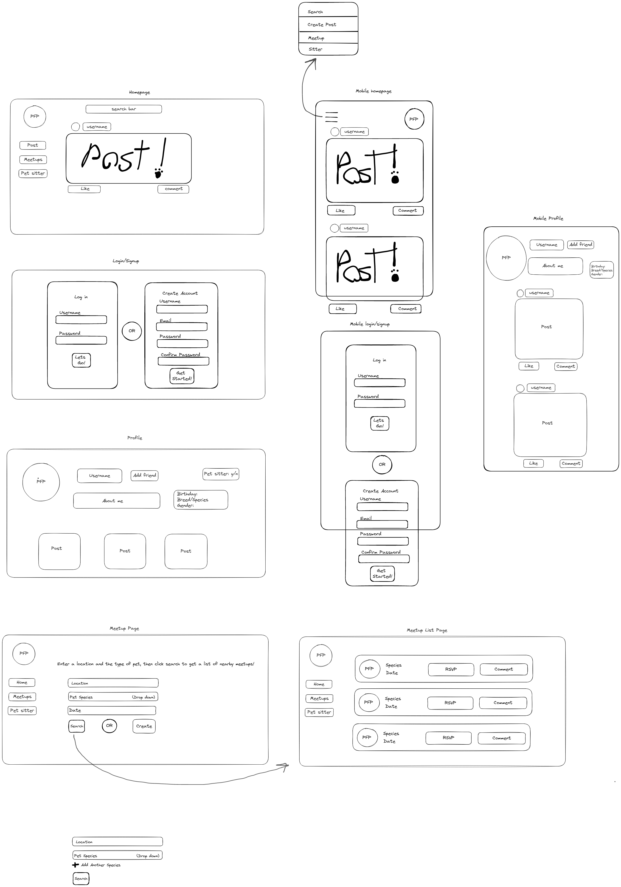

# Quell
Welcome to Quell, a supportive and empowering community platform dedicated to fostering mental well-being and personal growth. Our platform serves as a haven for individuals seeking support, resources, and meaningful connections.

## Description

### What was our motivation?
- Our motivation for created this app was that we see so many people struggling with their mental health every day, and they didn't have anyone to talk to about their problems. We wanted to give them a place where they could find someone to listen and chat with. We just felt like everyone deserves a supportive ear when they're going through tough times, you know? So, we made this app to help them feel less alone and hopefully find some comfort and healing along the way.

### Why did we build this project?
- We aimed to develop an application catered to individuals facing daily challenges with their mental health, providing a platform where they can openly discuss their problems with someone willing to listen and engage in meaningful conversations. This initiative addresses the need for a supportive environment when they feel there is no one else available to lend an ear and empathize with their struggles.

### What problems does it solve?
- Lack of support
- Isolation
- Emotional well-being

## Installation 
Simply click on the deployed heroku link and it should take you to our live application.

## Usage
Once you're on our live application, create a profile and start discussions or respond to other users' discussions.

## Wireframe

## Credits
- Stack Overflow https://stackoverflow.com/questions/62502855/replace-browserrouter-with-hashrouter (helped with heroku deployment errors)
- w3schools https://www.w3schools.com/
- MDN Webdocs https://developer.mozilla.org/en-US/
- FreeCodeCamp https://www.freecodecamp.org/
- 

## Links
Github Repository: https://github.com/roshniipatel/quell 

Heroku Deployment: https://quell-mental-health-9f784a2642a5.herokuapp.com/ 

## Contributors
Ellen Kolbly: https://github.com/notalisk 

Roshni Patel: https://github.com/roshniipatel 

Ulises Garfias: https://github.com/garfias06

## Ideas for improvement
- Add friends/followers
- Search and find other people's profiles
- Add desired profile picture
- Add a mood tracker or a journal 

## License 
MIT License
